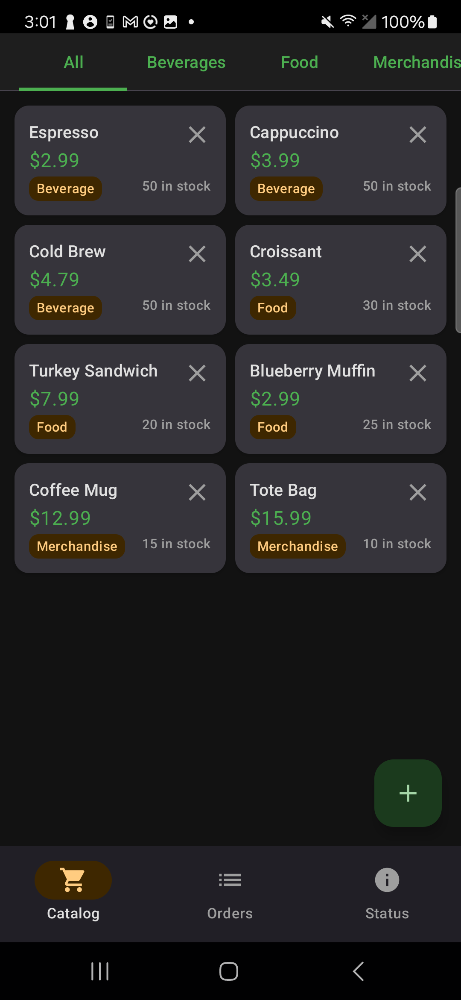
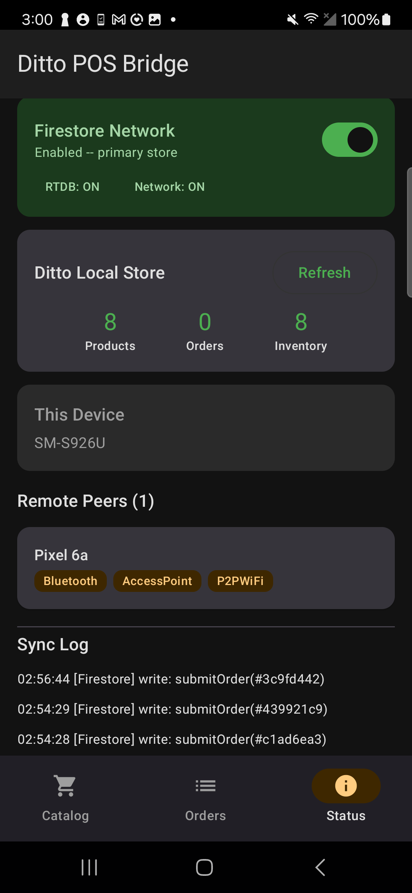

# Android Firebase POS — Firestore ↔ Ditto Bridge PoC

Proof of concept validating a bidirectional sync bridge between **Firebase Firestore** (cloud) and **Ditto** (local-first, peer-to-peer). The app is a point-of-sale terminal that writes to Firestore as its primary store, with automatic fallback to Ditto when Firestore is unreachable — enabling offline operation and P2P sync between devices.

## Screenshots

<p align="center">
  
  &nbsp;&nbsp;
  
</p>

<p align="center">
  <em>Left: Product catalog &nbsp;|&nbsp; Right: Status & debug panel with Firestore toggle, Ditto peers, and sync log</em>
</p>

## What This Validates

- **Firestore-first writes** with Ditto fallback when the network is unavailable
- **Bidirectional sync bridge** that keeps Firestore and Ditto in sync without infinite loops (change guards via `syncSource` field)
- **P2P mesh sync** between devices via Ditto when Firestore is disabled or offline
- **Live presence** showing connected Ditto peers and connection types
- **Debug tooling** with a Firestore network toggle, sync log, and Ditto store counts to observe bridge behavior in real time

## Architecture

```
                        ┌─────────────────────────────────────────┐
                        │           SyncBridgeManager             │
                        │                                         │
                        │   syncSource change guards prevent      │
                        │   infinite loops between stores         │
                        └──────────┬──────────────┬───────────────┘
                                   │              │
                    Snapshot        │              │  Store
                    Listeners       │              │  Observers
                                   ▼              ▼
               ┌───────────────────────┐   ┌───────────────────────┐
               │   Firebase Firestore  │   │        Ditto          │
               │     ☁️  Cloud Store    │   │   📱 Local + P2P     │
               │                       │   │                       │
               │  • Primary writes     │   │  • Fallback writes    │
               │  • Cloud persistence  │   │  • Offline reads      │
               │  • Cross-platform     │   │  • Mesh sync (BLE,    │
               │    access             │   │    WiFi, WebSocket)   │
               └───────────┬───────────┘   └───────────┬───────────┘
                           │                           │
                           │    ┌─────────────────┐    │
                           └───►│   ViewModels    │◄───┘
                                │                 │
                                │  Write → FS     │
                                │  Fail? → Ditto  │
                                │  Read  ← Ditto  │
                                └─────────────────┘
```

**Write path:** ViewModels write to Firestore first. If the write fails (offline, network toggled off), the app falls back to writing directly into Ditto. The sync bridge reconciles when connectivity returns.

**Read path:** Ditto store observers power all UI — data is always available regardless of cloud connectivity.

**Sync loop prevention:** Every document carries a `syncSource` field (`"local"`, `"firestore"`, or `"ditto"`). The bridge skips documents that originated from the other side, breaking potential infinite loops.

## Key Features

| Feature | Description |
|---------|-------------|
| Product catalog | Browse, add, and soft-delete products |
| Order management | Submit orders from cart, swipe-to-delete |
| Presence viewer | Live list of connected Ditto peers with connection types |
| Firestore toggle | Disable/enable Firestore network to simulate offline scenarios |
| Sync log | Real-time log showing every write target (Firestore vs Ditto fallback) and errors |
| Ditto seeder | Seeds product catalog directly into Ditto on first launch |

## Setup

1. Copy `.env.sample` to `.env` and fill in your Ditto credentials:
   ```
   DITTO_APP_ID=...
   DITTO_PLAYGROUND_TOKEN=...
   DITTO_AUTH_URL=...
   DITTO_WEBSOCKET_URL=...
   ```

2. Add your `google-services.json` for Firebase.

3. Build and run:
   ```bash
   ./gradlew installDebug
   ```

## Testing the Bridge

1. Launch the app on two devices
2. Go to the **Status** tab — both devices should appear as peers
3. Add a product or submit an order — check the sync log to see it write to Firestore
4. Toggle **Firestore Network** OFF on the Status tab
5. Repeat — the sync log should show writes falling back to Ditto
6. Both devices still sync via Ditto P2P mesh
7. Toggle Firestore back ON — the bridge reconciles

## Tech Stack

- Kotlin, Jetpack Compose, Material 3
- Ditto SDK (OnlinePlayground identity)
- Firebase Firestore + Realtime Database (connection detection)
- Koin dependency injection
- MVVM architecture
