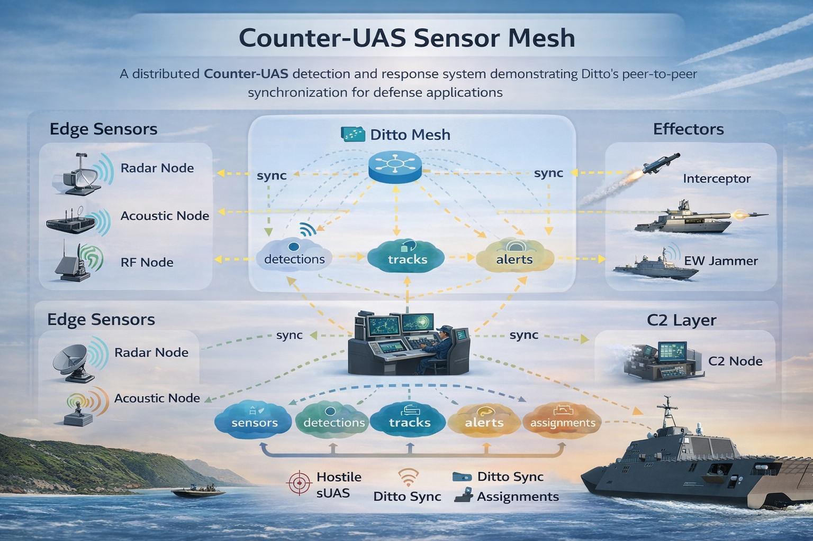
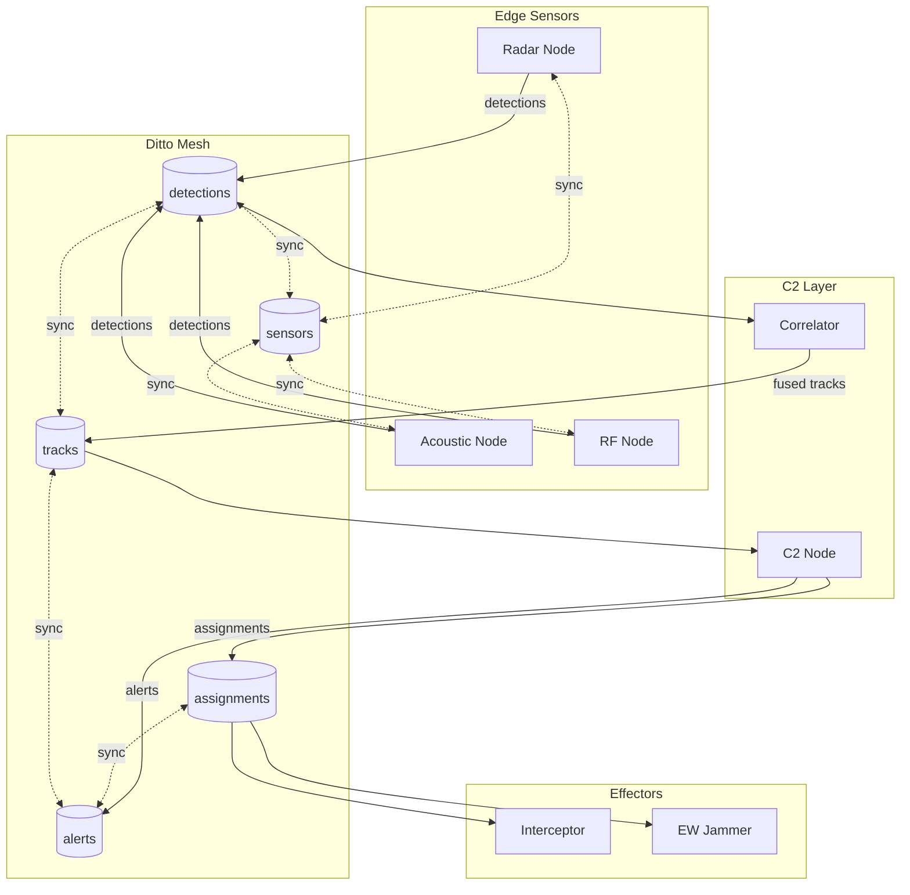
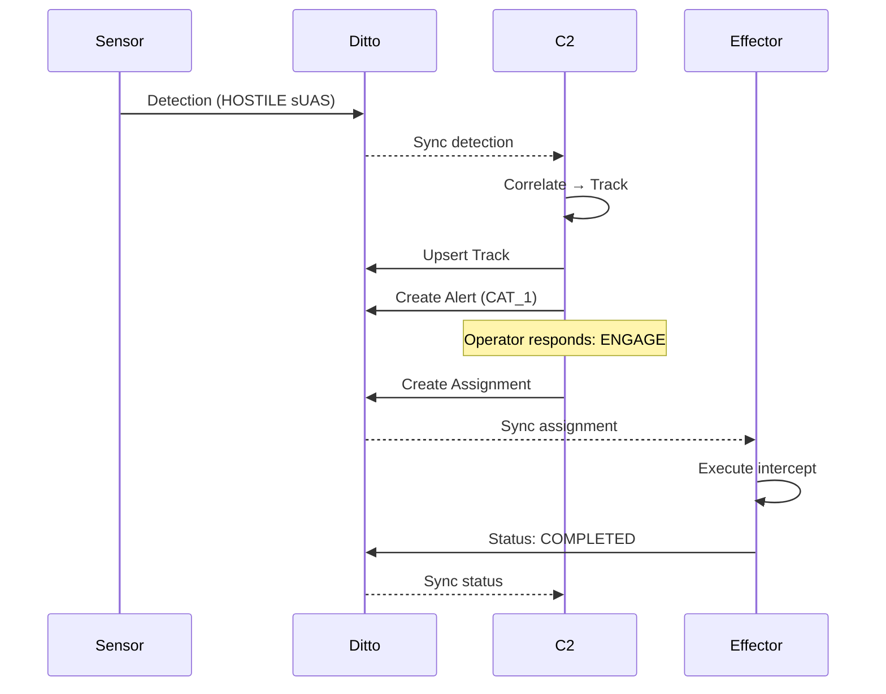

# Counter-UAS Sensor Mesh

A distributed Counter-UAS detection and response system demonstrating Ditto's peer-to-peer synchronization for defense applications.



## Architecture



## Data Flow



## Prerequisites

- CMake 3.16+, C++17 compiler
- Ditto credentials in `.env` file (copy from `.env.sample` at repo root)

## Quick Start (DevContainer)

The Ditto C++ SDK only supports Linux. Use the VS Code devcontainer for the easiest setup:

1. Open in VS Code → **"Reopen in Container"**
2. Build and run:
   ```bash
   make build
   make run-demo   # Single-process demo with all nodes
   ```

## Running Multiple Nodes

For true P2P sync, run each node in a separate terminal. Each node needs a unique persistence directory (handled automatically).

### Option 1: Separate Terminals

```bash
# Terminal 1 - Sensor
./build/cuas-mesh --mode sensor --id RADAR-1

# Terminal 2 - C2
./build/cuas-mesh --mode c2 --id C2-ALPHA

# Terminal 3 - Effector
./build/cuas-mesh --mode effector --id EFFECTOR-1
```

### Option 2: tmux (All in One)

```bash
make run-all   # Launches all nodes in tmux panes
```

### Option 3: Single-Process Demo

```bash
make run-demo  # All nodes in one process (shared memory, no real P2P)
```

## Building Manually

```bash
# Linux (downloads real Ditto SDK)
make build

# macOS/Windows (stub mode - local only)
cmake -B build && cmake --build build
```

## Collections

| Collection | Purpose | Key Fields |
|------------|---------|------------|
| `sensors` | Registered sensor nodes | `_id`, `platform_type`, `lat/lon`, `status` |
| `detections` | Raw sensor detections | `_id`, `sensor_id`, `identity`, `bearing/range` |
| `tracks` | Correlated/fused tracks | `_id`, `track_number`, `identity`, `threat_level` |
| `alerts` | Threat alerts | `_id`, `track_id`, `category`, `state` |
| `assignments` | Effector tasking | `_id`, `track_id`, `effector_id`, `type`, `status` |

## TUI Controls

### Sensor Mode
- **Toggle Simulation** - Start/stop simulated drone detections
- **Inject Hostile** - Manually create a hostile detection

### C2 Mode
- **↑/↓** - Select track
- **Engage Track** - Assign interceptor to selected track
- **EW Jam** - Assign EW jammer to selected track
- **Clear All** - Reset all data (sensors, detections, tracks, alerts, assignments)

### Effector Mode
- **Confirm Kill/Jam** - Mark assignment complete
- **Abort** - Abort current assignment

## Configuration

Environment variables (`.env`):

```
DITTO_APP_ID=your_app_id
DITTO_PLAYGROUND_TOKEN=your_token
DITTO_AUTH_URL=https://auth.ditto.live
DITTO_WEBSOCKET_URL=wss://ws.cloud.ditto.live
```

## Project Structure

```
cpp-sensor-mesh/
├── CMakeLists.txt
├── README.md
├── scripts/
│   ├── generate_env.awk    # Generates env.h from .env
│   └── run_demo.sh         # Multi-terminal launcher
├── src/
│   ├── main.cpp
│   ├── models/             # Data models (OMNI-based)
│   │   ├── enums.h
│   │   ├── sensor.h/cpp
│   │   ├── detection.h/cpp
│   │   ├── track.h/cpp
│   │   ├── alert.h/cpp
│   │   └── assignment.h/cpp
│   ├── ditto/              # Ditto integration
│   │   ├── collections.h
│   │   └── mesh_peer.h/cpp
│   ├── nodes/              # Node implementations
│   │   ├── sensor_node.h/cpp
│   │   ├── c2_node.h/cpp
│   │   └── effector_node.h/cpp
│   ├── correlation/        # Track correlation
│   │   └── correlator.h/cpp
│   ├── simulation/         # Drone simulation
│   │   └── drone_sim.h/cpp
│   └── tui/                # Terminal UI
│       └── app.h/cpp
├── tests/
│   ├── test_models.cpp
│   ├── test_correlation.cpp
│   ├── test_ditto_sync.cpp
│   └── test_workflow.cpp
└── ml/
    └── TODO.md             # ML model integration placeholder
```

## P2P Synchronization

When built with the real Ditto SDK on Linux, this application demonstrates true peer-to-peer synchronization:

### Multi-Device Sync

Run on multiple Linux devices or containers to see data sync in real-time:

```bash
# Terminal 1 (Device A - Sensor)
./build/cuas-mesh --mode sensor --id RADAR-1

# Terminal 2 (Device B - C2)
./build/cuas-mesh --mode c2 --id C2-ALPHA

# Terminal 3 (Device C - Effector)
./build/cuas-mesh --mode effector --id EFFECTOR-1
```

Each node can run on a separate physical device. Ditto automatically discovers peers and syncs data:

- **Sensor** detections propagate to **C2** in real-time
- **C2** assignments reach **Effectors** even without internet
- All nodes stay synchronized even during network disruptions

### Transport Options

Ditto supports multiple P2P transports that work simultaneously:

- **Bluetooth LE** - Works when WiFi is unavailable
- **WiFi Direct** - High-bandwidth local sync
- **LAN** - Fast sync on shared networks
- **WebSocket** - Sync via Big Peer cloud relay

Configure transports in `mesh_peer.cpp`:

```cpp
ditto->update_transport_config([](ditto::TransportConfig& config) {
    config.enable_all_peer_to_peer();  // Enable BLE, WiFi, LAN
    config.connect.websocket_urls.insert(websocket_url);  // Cloud relay
});
```

## How Ditto Solves This

| Challenge | Ditto Solution |
|-----------|----------------|
| Intermittent connectivity | Offline-first with automatic sync |
| Multi-sensor fusion | Real-time document sync across nodes |
| Distributed C2 | CRDT-based conflict resolution |
| Low latency | Peer-to-peer mesh, no cloud required |
| Scale | Subscription-based queries for efficiency |

## License

MIT
