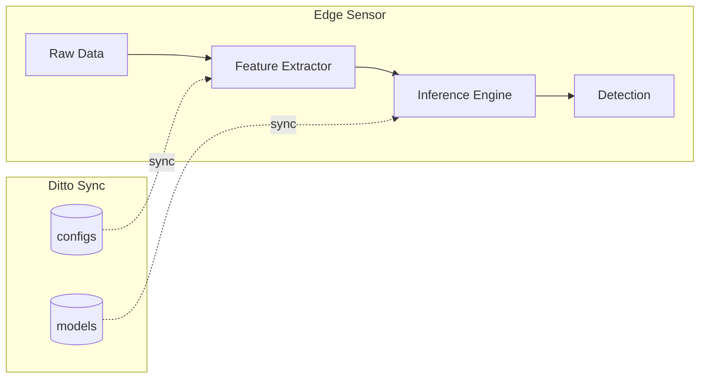

# ML Model Integration - TODO

This document outlines the planned ML model integration for drone classification.

## Overview

The Counter-UAS system will use ML models to:
1. Classify drone type from acoustic/RF signatures
2. Predict threat level from flight patterns
3. Recommend optimal effector response

## Architecture



## TODO Items

### Phase 1: Model Infrastructure
- [ ] Add `models` collection to Ditto schema
- [ ] Implement model version tracking
- [ ] Create model download/cache mechanism
- [ ] Add model hash verification

### Phase 2: Feature Extraction
- [ ] Acoustic feature pipeline (MFCC, spectrogram)
- [ ] RF feature pipeline (frequency analysis)
- [ ] Flight pattern feature extraction

### Phase 3: Inference Integration
- [ ] ONNX Runtime integration
- [ ] TensorFlow Lite integration
- [ ] Model loading from Ditto attachments
- [ ] Inference result to Detection mapping

### Phase 4: Model Updates
- [ ] A/B testing framework for model versions
- [ ] Model performance metrics collection
- [ ] Automatic model rollback on degradation

## Model Schema

```json
{
  "_id": "model-drone-classifier-v1",
  "name": "Drone Classifier",
  "version": "1.0.0",
  "type": "classification",
  "framework": "onnx",
  "input_shape": [1, 128],
  "output_classes": ["DJI", "Parrot", "Custom", "Unknown"],
  "created": 1234567890,
  "attachment_id": "model_blob_id"
}
```

## Notes

- Models will be distributed as Ditto attachments
- Edge devices pull models on startup or when new versions available
- Inference runs locally, no cloud dependency
- Consider quantized models for embedded sensors
